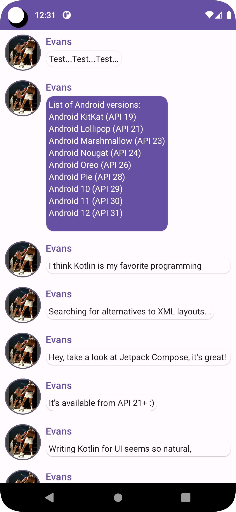

# FinallyAComposeCodelab 

Just a fun learning compose exercise. Looks nice.

Played around and turned it to a library.

From here https://developer.android.com/jetpack/compose/tutorial?authuser=1

